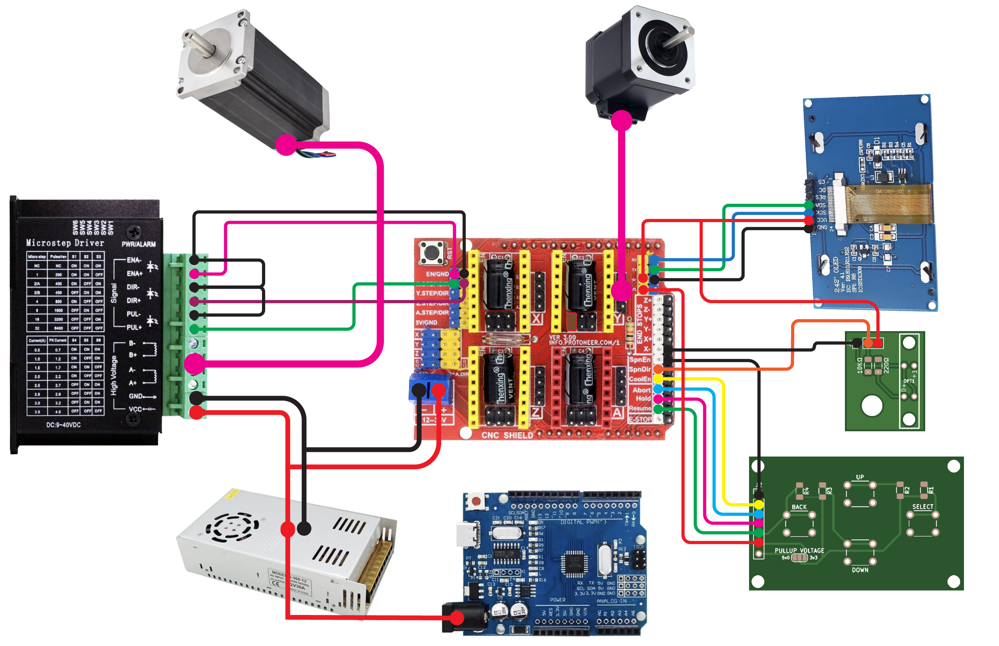

# CutMachineSMD

The Resistor and LED Cutting machine is a community project to make mass-production of small SMD components cut to specific unit sizes faster and easier to make for our highly popular MiniBadge initiatives and standards.  This machine has been used in mass-production and works great for feeding and cutting several component types.

#### Key Features
- SMD Tape Cutting
- Custom Menu-Driven Calibration Settings
- Test Cutting and Program Cutting
- Sharpie Attachment to allow color-coding of components as they are cut
- Community Contribution

# Parts List:  

For convenience I have an Amazon List for most parts: https://a.co/ecXTVj9

- 2020 Extruded Aluminium cut to
  - 2x 30cm - Top/Bottom
  - 3x 26cm - Verticals
  - 2x 20cm - Legs
  - 1x 155mm - Horizontal Crossmember
  - 1x 155mm - Roll Attachment Crossmember (Optional)
- 2020 Series Connectors and Corner Bracket Set (30 Piece)
- Bracket L-Type Internal Connectors for 2020 Series
- 4x 2020 Series Rubber Feet
- Stepper Motors
  - NEMA23 4.2Amp Motor (StepperOnline 23HS45-4204S)
  - NEMA17 1.2Amp Motor (StepperOnline 17HS19-2004S)
- Motor Drivers
  - 1x EASON Stepper Motor Driver TB6600 4A
  - 2x Stepper Motor Driver DRV8825
- Cutting Blades - 9mm Knife Replacement Blade Cartridge
- Electronics
  - Arduino Uno R3 or similar device.
  - HiLetgo CNC Drive Expansion Board (CNC Shield)
  - 2.42" 128x64 OLED LCD Display (SSD1309) i2C
- M3 Hardware
  - Assorted M2 Length Screws, Nuts, Washers
  - Assorted M3 Length Screws, Nuts, Washers
  - Assorted M5 Length Screws, Nuts, Washers
  - M3 Lever Steering Linkage
  - M3 Link Strut shaft 35mm
- 1x Miniature Linear Sliding Guideway Rail 150mm
- Power Supplies
  - 12VDC 15A Linear Power Supply
  - 12VDC to 5VDC Stepdown Regulator to power the Arduino
- Components for PCBs ([Digikey](https://digikey.com)/[Mouser](https://mouser.com) or Similar)
  - 4x 6mm THT PushButton Switchs
  - 6x 10KΩ SMD  1206 Resistors
  - 1x 220Ω SMD  1206 Resistor
  - 1x 2.2KΩ SMD 1206 Resistor
  - 7+ Position Right-Angle PIN Headers
  - 3+ Position Straight PIN Headers
- PCBs Ordered (JLC_PCB or Similar)
  - [1x Button_Board](https://github.com/utahsaint-org/CutMachineSMD/tree/main/CuttingMachine_PCB/Buttons/Gerbers) 
  - [2x Sensor_Board](https://github.com/utahsaint-org/CutMachineSMD/tree/main/CuttingMachine_PCB/Sensor/Gerbers)
    
# Setup and Configuration

### OLED Screen Modification
The OLED screen typically comes configured for SPI interface, and we are using I2C protocol in this project.   As such, you will need to modify the OLED screen by bridging several solder pads to put the screen into I2C configuration.   You will need to disconnect the ribbon-cable and underneath you will need to bridge the solder pads labeled: R9, R10, R11, R12.  You will also need to remove the Resistor labeled R8. (Follow the published instructions for the screen to make this modification)

### Building the Framework
The Framework for the machine is fairly stratight-forward.  The 30cm struts are mounted as the top and bottom rails.  Use normal corner attachments to make the connections.  The 26cm vertical struts are attached with one in the middle and the other two are attached on the edges to make a 30cm x 30cm frame.  The center vertical is attached at 105mm spacing from center to center or 85mm Internal spacing.  You can use the Acrylic Cut Head mount as the spacing guide.   Lastly the cross-member can be attached at the approximate horizontal mid-point (125mm internal spacing).  20cm Legs are mounted horizontally outside the frame for stability.  The frame with mounted motors becomes back-heavy so I personally offset the legs to favor the back side for better support.

### Power Supply
Picking the right power-supply is an important aspect of any Stepper Motor configuration.   For this machine I used a 12v 15A capable power supply.   This provided all of the power I needed to run both motors and the arduino electronics.

### 3D Printing
Several of the STL designs need **supports** to be printed to ensure they are printed correctly.
NOTE: There are two Cut Heads.  One for Resistors and one for LEDs.

### Assembly
- Build the Framework as described above.
- Attach the AcrylicCutHead on the Back Side of the machine

- Attach a RazorBlade to the Printed CutHead on the outside
  - Bottom Screw goes THRU the hole on the blade
  - Top Screw squeezes the blade to the head using a washer

### Connections
Connections for all of the components are outlined in the diagram below.

### PCB Boards
The PCB Boards Gerbers are included in this repo.  The following instructions will help you assemble the boards and connect them properly.

#### Button_Board
- R1, R2, R3, R4 are all **10k Ohm** resistors.
- Buttons are THT 6mm Momentary Switch.
- Right-angle PIN HEADERS are suggested exiting out the back.
- Use a Solder Jumper to connect either 5v or 3v3. (Recommended you use 3v3)
- Attach the Board with M2 Screws/Bolts to the Display Controller.
- Attach the Connectors to CNC Shield as labeled in the Connections Diagram.

#### Sensor_Board
- R1 is 10K Ohm
- R2 is 470 Ohm (if using it as presence sensor)
- R2 is 2.2K Ohm (If used as tape position sensor)
- PIN HEADERS are 3 Position
- Attach the Board with the M5 Screw to the FeedHead
  

